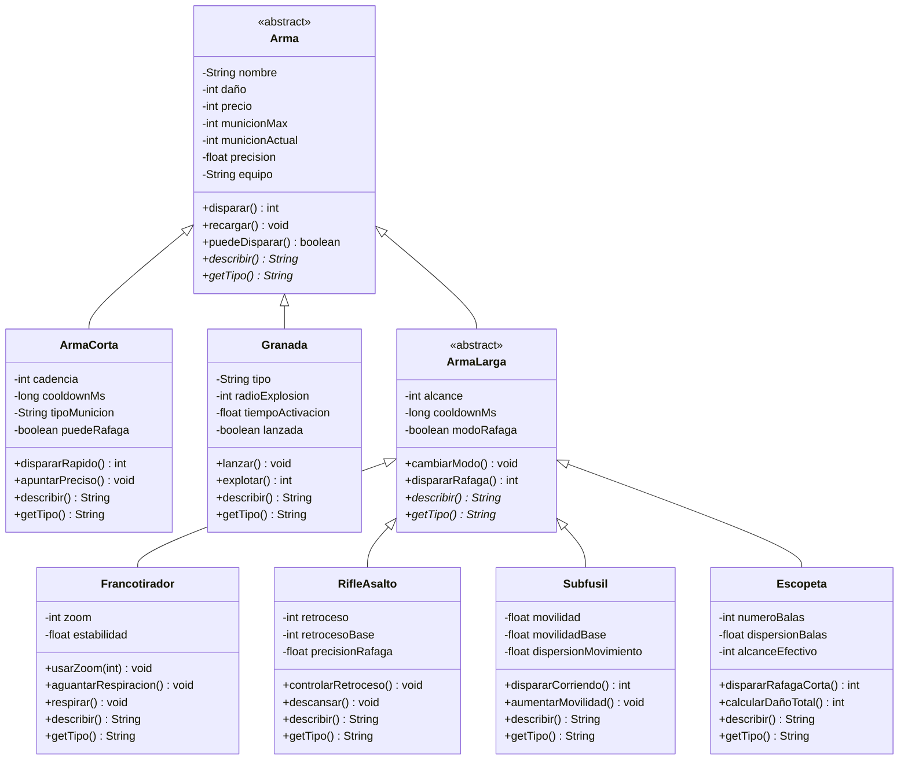

# mj-taller-git-2026

**Nombre:** Matías Jara
**Usuario GitHub:** Vanzfranhait
**Comisión:** CYT646 F
**Asignatura:** Lenguaje de Programación 3 (LP3)

## Cómo levantar la API

```bash
./mvnw spring-boot:run
```

La API arranca en: http://localhost:8080

Para detenerla: `Ctrl + C`

## Requisitos

- Java 21
- Maven (incluido en el wrapper `./mvnw`)

## Documentación

- `RUN.md` — Instrucciones detalladas de ejecución
- `docs/TALLER_GIT.md` — Guía del taller (si la copiaste al repo)

## Modelado POO

El modelado de Counter-Strike 2 se encuentra en el paquete:

```
src/main/java/py/edu/uc/lp3/cs2/
```

> 📌 El diagrama de clases y la documentación del modelo están en la **descripción del Pull Request**.
## Diagrama de clases (modelado CS2)


