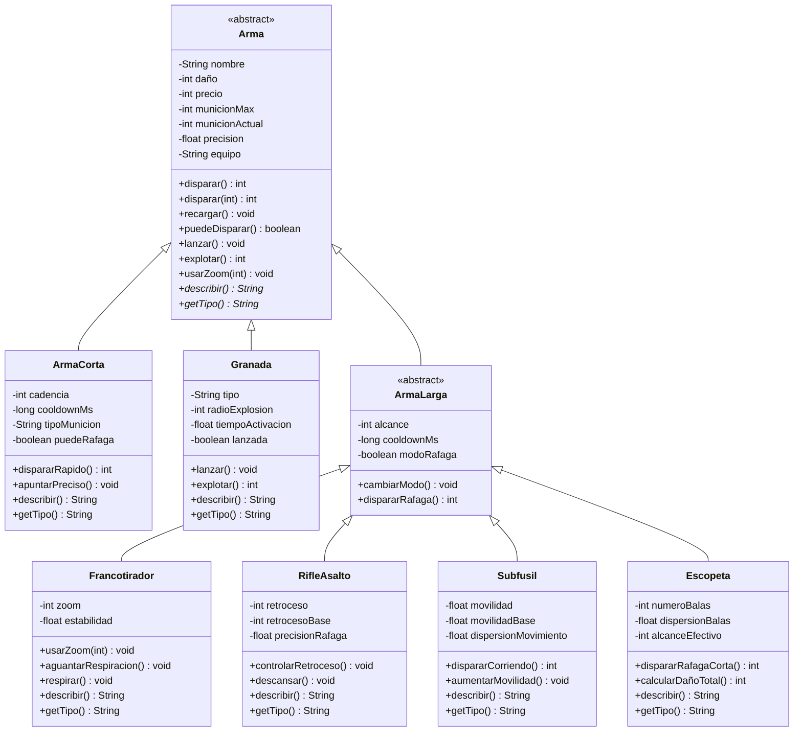

# mj-taller-git-2026

> **Commit de la solución:** [`64f3f7b`](https://github.com/Vanzfranhait/mj-taller-git-2026/commit/64f3f7b)

**Nombre:** Matías Jara
**Usuario GitHub:** Vanzfranhait
**Comisión:** CYT646 F
**Asignatura:** Lenguaje de Programación 3 (LP3)
**Dominio:** Counter-Strike 2

## Cómo levantar la API

```bash
./mvnw spring-boot:run
```

La API arranca en: http://localhost:8080

Para detenerla: `Ctrl + C`

## Requisitos

- Java 21
- Maven (incluido en el wrapper `./mvnw`)

## Documentación

- `RUN.md` — Instrucciones detalladas de ejecución
- `docs/TALLER_GIT.md` — Guía del taller
- `BITACORA.md` — Bitácora de asistencia de IA (marca, modelo de LLM, prompts)

## Endpoints REST

Una vez arrancado el servicio en `http://localhost:8080`:

| Método | Ruta | Qué hace |
|--------|------|----------|
| `GET` | `/` | Confirma que el servicio está vivo. |
| `GET` | `/api/armas` | Lista todas las armas del inventario con su descripción (JSON). |
| `GET` | `/api/armas/{nombre}` | Devuelve la descripción de un arma específica. |
| `POST` | `/api/armas/{nombre}/disparar` | Dispara el arma y devuelve el daño infligido. |
| `POST` | `/api/armas/{nombre}/recargar` | Recarga el arma al máximo. |
| `POST` | `/api/granadas/{nombre}/lanzar` | Lanza una granada (solo si es una granada). |
| `POST` | `/api/granadas/{nombre}/explotar` | Explota una granada ya lanzada. |
| `POST` | `/api/francotiradores/{nombre}/zoom/{nivel}` | Cambia el zoom de un francotirador. |
| `GET` | `/api/construir/arma` | Construye un arma desde parámetros de URL y devuelve JSON. |

### Ejemplos

```bash
# Confirmar que el servicio está vivo
curl http://localhost:8080/

# Listar todas las armas
curl http://localhost:8080/api/armas

# Ver un arma específica
curl "http://localhost:8080/api/armas/AWP"

# Disparar
curl -X POST http://localhost:8080/api/armas/USP-S/disparar

# Lanzar y explotar una granada
curl -X POST http://localhost:8080/api/granadas/HE/lanzar
curl -X POST http://localhost:8080/api/granadas/HE/explotar

# Cambiar zoom de un francotirador
curl -X POST http://localhost:8080/api/francotiradores/AWP/zoom/5

# Construir un arma desde la URL
curl "http://localhost:8080/api/construir/arma?nombre=Glock-18&dano=30&precio=200&municion=20&precision=0.8&equipo=T&cadencia=400&municionTipo=9mm"
```

## Modelado POO

El modelado de Counter-Strike 2 se encuentra en el paquete:

```
src/main/java/py/edu/uc/lp3/domain/
```

Los servicios REST están en:

```
src/main/java/py/edu/uc/lp3/rest/controller/
```

## Diagrama de clases (modelado CS2)


```mermaid
classDiagram
    class Arma {
        <<abstract>>
        -String nombre
        -int daño
        -int precio
        -int municionMax
        -int municionActual
        -float precision
        -String equipo
        +disparar() int
        +disparar(int) int
        +recargar() void
        +puedeDisparar() boolean
        +lanzar() void
        +explotar() int
        +usarZoom(int) void
        +describir()* String
        +getTipo()* String
    }

    class ArmaCorta {
        -int cadencia
        -long cooldownMs
        -String tipoMunicion
        -boolean puedeRafaga
        +dispararRapido() int
        +apuntarPreciso() void
        +describir() String
        +getTipo() String
    }

    class Granada {
        -String tipo
        -int radioExplosion
        -float tiempoActivacion
        -boolean lanzada
        +lanzar() void
        +explotar() int
        +describir() String
        +getTipo() String
    }

    class ArmaLarga {
        <<abstract>>
        -int alcance
        -long cooldownMs
        -boolean modoRafaga
        +cambiarModo() void
        +dispararRafaga() int
    }

    class Francotirador {
        -int zoom
        -float estabilidad
        +usarZoom(int) void
        +aguantarRespiracion() void
        +respirar() void
        +describir() String
        +getTipo() String
    }

    class RifleAsalto {
        -int retroceso
        -int retrocesoBase
        -float precisionRafaga
        +controlarRetroceso() void
        +descansar() void
        +describir() String
        +getTipo() String
    }

    class Subfusil {
        -float movilidad
        -float movilidadBase
        -float dispersionMovimiento
        +dispararCorriendo() int
        +aumentarMovilidad() void
        +describir() String
        +getTipo() String
    }

    class Escopeta {
        -int numeroBalas
        -float dispersionBalas
        -int alcanceEfectivo
        +dispararRafagaCorta() int
        +calcularDañoTotal() int
        +describir() String
        +getTipo() String
    }

    Arma <|-- ArmaCorta
    Arma <|-- Granada
    Arma <|-- ArmaLarga

    ArmaLarga <|-- Francotirador
    ArmaLarga <|-- RifleAsalto
    ArmaLarga <|-- Subfusil
    ArmaLarga <|-- Escopeta
```

## Sobrecarga y sobreescritura

### Sobrecarga (overloading)

La **sobrecarga** ocurre cuando varios métodos tienen el **mismo nombre** pero **distinta lista de argumentos** (distinta firma). Se resuelve en tiempo de compilación.

#### Sobrecarga de constructores

**En `Arma`** (clase base):

```java
// Constructor completo
protected Arma(String nombre, int daño, int precio, int municionMax,
               float precision, String equipo)

// Constructor simplificado (sobrecarga)
protected Arma(String nombre, int daño)
```

El constructor simplificado llama al completo con `this(...)` y valores por defecto.

**En `ArmaCorta`** (clase hija):

```java
// Constructor completo
public ArmaCorta(String nombre, int daño, int precio, int municionMax,
                 float precision, String equipo,
                 int cadencia, String tipoMunicion, boolean puedeRafaga)

// Constructor simplificado (sobrecarga)
public ArmaCorta(String nombre, int daño)
```

Ambos constructores dejan el objeto en un **estado válido**. Ninguno rompe los invariantes.

#### Sobrecarga de un mensaje del dominio

**En `Arma`**:

```java
// Dispara 1 tiro
public int disparar()

// Dispara N tiros (sobrecarga)
public int disparar(int cantidad)
```

Mismo nombre (`disparar`), distinta firma. El segundo reutiliza al primero.

---

### Sobreescritura (overriding)

La **sobreescritura** ocurre cuando una **clase hija redefine un método del padre** con la **misma firma**. Se resuelve en tiempo de ejecución (polimorfismo dinámico).

| Método | Declarado en | Sobreescrito por |
|--------|-------------|------------------|
| `describir()` | `Arma` (abstracto) | `ArmaCorta`, `Granada`, `Francotirador`, `RifleAsalto`, `Subfusil`, `Escopeta` |
| `getTipo()` | `Arma` (abstracto) | Las 8 hijas |
| `disparar()` | `Arma` | `Escopeta` (daño según perdigones), `Francotirador` (falla si no está estabilizado) |
| `dispararRafaga()` | `ArmaLarga` | `RifleAsalto` (aumenta el retroceso) |
| `lanzar()` | `Arma` (por defecto lanza `UnsupportedOperationException`) | `Granada` |
| `explotar()` | `Arma` (por defecto lanza `UnsupportedOperationException`) | `Granada` |
| `usarZoom(int)` | `Arma` (por defecto lanza `UnsupportedOperationException`) | `Francotirador` |

**Ejemplo en código:**

```java
// En Arma (padre)
public abstract String describir();

// En Francotirador (hija) — sobreescribe
@Override
public String describir() {
    return String.format("%s [%s] - Daño: %d | Zoom: x%d",
        getNombre(), getTipo(), getDaño(), zoom);
}
```

**Diferencia clave:**

- **Sobrecarga:** mismo nombre, **distinta firma** (parámetros). Se resuelve en compilación.
- **Sobreescritura:** mismo nombre, **misma firma**, en clase hija. Se resuelve en ejecución.

---

### Qué cambió respecto al modelado de septiembre

En este ejercicio se agregaron los dos mecanismos sobre el modelado original:

**Sobrecarga agregada:**

- En `Arma`: constructor simplificado `Arma(String, int)` y método `disparar(int cantidad)`.
- En `ArmaCorta`: constructor simplificado `ArmaCorta(String, int)`.

**Sobreescritura agregada o explicitada:**

- `@Override` en `describir()` y `getTipo()` de las 8 clases hijas (implementación de los abstractos de `Arma`).
- `@Override` en `disparar()` de `Escopeta` (daño por perdigones) y de `Francotirador` (falla si no está estabilizado).
- `@Override` en `dispararRafaga()` de `RifleAsalto` (aumenta el retroceso).
- `@Override` en `lanzar()` y `explotar()` de `Granada`, y en `usarZoom(int)` de `Francotirador`, sobre métodos nuevos que la clase base `Arma` declara con `UnsupportedOperationException` por defecto.

Ese último grupo es clave para el diseño: permitió eliminar los `instanceof` del `VanzfranhaitController`. El controller le pide a cualquier `Arma` que `lanzar()`, `explotar()` o `usarZoom()`, y es el propio objeto quien decide si puede o no. Si no puede, la clase base lanza la excepción y el controller la traduce a un HTTP 400.

### Por qué importa el diseño

El controller `VanzfranhaitController` trata todas las armas como tipo padre `Arma`:

```java
for (Map.Entry<String, Arma> entrada : inventario.entrySet()) {
    respuesta.put(entrada.getKey(), entrada.getValue().describir());
}
```

**No hay ningún `instanceof` en el código del controller.** Cada objeto responde su propio `describir()`, su propio `disparar()`, su propio `lanzar()`. Eso es polimorfismo por sobreescritura.

## Licencia

Este proyecto está bajo la licencia **Apache 2.0**.
Ver el archivo [LICENSE](LICENSE) para el texto completo.
