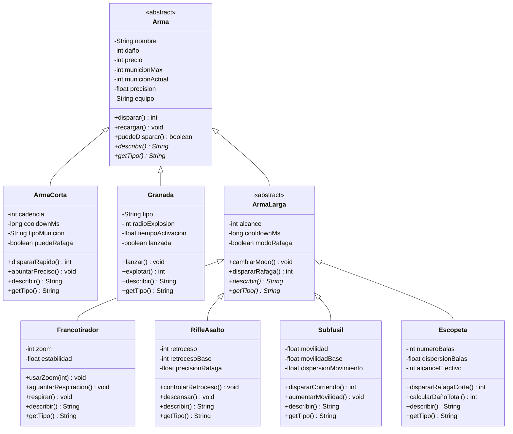

# mj-taller-git-2026

**Nombre:** Matías Jara
**Usuario GitHub:** Vanzfranhait
**Comisión:** CYT646 F
**Asignatura:** Lenguaje de Programación 3 (LP3)

## Cómo levantar la API

```bash
./mvnw spring-boot:run
```

La API arranca en: http://localhost:8080

Para detenerla: `Ctrl + C`

## Requisitos

- Java 21
- Maven (incluido en el wrapper `./mvnw`)

## Documentación

- `RUN.md` — Instrucciones detalladas de ejecución
- `docs/TALLER_GIT.md` — Guía del taller 

## Modelado POO

El modelado de Counter-Strike 2 se encuentra en el paquete:

```
src/main/java/py/edu/uc/lp3/cs2/
```

> 📌 El diagrama de clases y la documentación del modelo están en la **descripción del Pull Request**.
## Diagrama de clases (modelado CS2)


```mermaid
classDiagram
    class Arma {
        <<abstract>>
        -String nombre
        -int daño
        -int precio
        -int municionMax
        -int municionActual
        -float precision
        -String equipo
        +disparar() int
        +recargar() void
        +puedeDisparar() boolean
        +describir()* String
        +getTipo()* String
    }

    class ArmaCorta {
        -int cadencia
        -long cooldownMs
        -String tipoMunicion
        -boolean puedeRafaga
        +dispararRapido() int
        +apuntarPreciso() void
        +describir() String
        +getTipo() String
    }

    class Granada {
        -String tipo
        -int radioExplosion
        -float tiempoActivacion
        -boolean lanzada
        +lanzar() void
        +explotar() int
        +describir() String
        +getTipo() String
    }

    class ArmaLarga {
        <<abstract>>
        -int alcance
        -long cooldownMs
        -boolean modoRafaga
        +cambiarModo() void
        +dispararRafaga() int
        +describir()* String
        +getTipo()* String
    }

    class Francotirador {
        -int zoom
        -float estabilidad
        +usarZoom(int) void
        +aguantarRespiracion() void
        +respirar() void
        +describir() String
        +getTipo() String
    }

    class RifleAsalto {
        -int retroceso
        -int retrocesoBase
        -float precisionRafaga
        +controlarRetroceso() void
        +descansar() void
        +describir() String
        +getTipo() String
    }

    class Subfusil {
        -float movilidad
        -float movilidadBase
        -float dispersionMovimiento
        +dispararCorriendo() int
        +aumentarMovilidad() void
        +describir() String
        +getTipo() String
    }

    class Escopeta {
        -int numeroBalas
        -float dispersionBalas
        -int alcanceEfectivo
        +dispararRafagaCorta() int
        +calcularDañoTotal() int
        +describir() String
        +getTipo() String
    }

    Arma <|-- ArmaCorta
    Arma <|-- Granada
    Arma <|-- ArmaLarga

    ArmaLarga <|-- Francotirador
    ArmaLarga <|-- RifleAsalto
    ArmaLarga <|-- Subfusil
    ArmaLarga <|-- Escopeta
```
## Sobrecarga y sobreescritura

### Sobrecarga (overloading)

La **sobrecarga** ocurre cuando varios métodos tienen el **mismo nombre** pero **distinta lista de argumentos** (distinta firma). En el dominio CS2 se aplica así:

#### Sobrecarga de constructores

**En `Arma`** (clase base):

```java
// Constructor completo
protected Arma(String nombre, int daño, int precio, int municionMax,
               float precision, String equipo)

// Constructor simplificado (sobrecarga)
protected Arma(String nombre, int daño)
```

El constructor simplificado llama al completo con `this(...)` y valores por defecto.

**En `ArmaCorta`** (clase hija):

```java
// Constructor completo
public ArmaCorta(String nombre, int daño, int precio, int municionMax,
                 float precision, String equipo,
                 int cadencia, String tipoMunicion, boolean puedeRafaga)

// Constructor simplificado (sobrecarga)
public ArmaCorta(String nombre, int daño)
```

Ambos constructores dejan el objeto en un **estado válido**. Ninguno rompe los invariantes.

#### Sobrecarga de un mensaje del dominio

**En `Arma`**:

```java
// Dispara 1 tiro
public int disparar()

// Dispara N tiros (sobrecarga)
public int disparar(int cantidad)
```

Mismo nombre (`disparar`), distinta firma. El segundo reutiliza al primero.

---

### Sobreescritura (overriding)

La **sobreescritura** ocurre cuando una **clase hija redefine un método del padre** con la **misma firma**. En el dominio CS2:

| Método | Declarado en | Sobreescrito por |
|--------|-------------|------------------|
| `describir()` | `Arma` (abstracto) | `ArmaCorta`, `Granada`, `Francotirador`, `RifleAsalto`, `Subfusil`, `Escopeta` |
| `getTipo()` | `Arma` (abstracto) | Las 8 hijas |
| `disparar()` | `Arma` | `Escopeta` (calcula daño según perdigones) |
| `dispararRafaga()` | `ArmaLarga` | `RifleAsalto` (aumenta retroceso) |

**Ejemplo en código:**

```java
// En Arma (padre)
public abstract String describir();

// En Francotirador (hija) — sobreescribe
@Override
public String describir() {
    return String.format("%s [%s] - Daño: %d | Zoom: x%d",
        getNombre(), getTipo(), getDaño(), zoom);
}
```

**Diferencia clave:**

- **Sobrecarga:** mismo nombre, **distinta firma** (parámetros)
- **Sobreescritura:** mismo nombre, **misma firma**, en clase hija

---

### ¿Por qué importa el diseño?

El controller `VanzfranhaitController` trata todas las armas como tipo padre `Arma`:

```java
for (Arma arma : inventario.values()) {
    respuesta.put(arma.getNombre(), arma.describir());
}
```

**No hay `if (arma instanceof Francotirador)`.** Cada objeto responde su propio `describir()`. Eso es polimorfismo por sobreescritura.
## Licencia

Este proyecto está bajo la licencia **Apache 2.0**.
Ver el archivo [LICENSE](LICENSE) para el texto completo.
